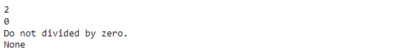

---
layout:
  title:
    visible: true
  description:
    visible: false
  tableOfContents:
    visible: true
  outline:
    visible: true
  pagination:
    visible: true
---

# 개념\_파이썬 프로그래밍

## 8.&#x20;

## 9. 함수 (Function)

### 1) 정의

* 한 가지의 기능을 하는 코드 묶음으로, input을 받아서 처리하고 output을 돌려주는 코드.

<pre class="language-python"><code class="lang-python"><a data-footnote-ref href="#user-content-fn-1">def function1(a, b):</a>
    something = ...
    &#x3C;statement>
    &#x3C;statement>
    ...
    ...
    return something
    
result = function1(3, 5)
</code></pre>

### 2) 동작 원리&#x20;

* input(=parameter = argument)을 받아서 주어진 기능대로 처리한 뒤, output을 return합니다.
* `Parameterisation` - 위 과정을 잘 의도하는 행위
* `Function call` - 정의한 함수를 사용하는  행위&#x20;
* `Refactoring` - 기능을 하는 코드를 만든 후 재구조화하는 행위 (↔ 기존 코드를 설계할 때부터 함수로 작성)&#x20;

### 3) 사용 이유 &#x20;

* 코드를 구조화하기 쉽습니다!&#x20;
* [<mark style="color:red;">가독성</mark>](#user-content-fn-2)[^2]<mark style="color:red;">이 높고, 유지/보수가 편하다.</mark>&#x20;
* 구조화된 코드는 코드의 재사용성(Reusability) 즉,  <mark style="color:red;">코드의 생산성이 향상</mark>됩니다.&#x20;

## 10. I/O (Input/Output)

### 1) 정의

* <mark style="color:red;">I</mark>/<mark style="color:green;">O</mark> : <mark style="color:red;">Input</mark>/<mark style="color:green;">Output</mark>의 약자로 컴퓨터가 데이터를 입력받고 출력하는 모든 작업을 의미합니다.&#x20;

<figure><figcaption><p>Source : https://en.wikiversity.org/wiki/Hardware#/media/File:Computer1.png</p></figcaption></figure>

* `Input/output` - 프로그램 입장에서 들어오는 모든 데이터/나가는 모든 데이터
* `I/O 처리` - 메인 메모리 입장에서 생각하는 들어오고 나가는 모든 데이터(단, CPU와의 소통은 제외)
* [`stdin/stdout`](#user-content-fn-3)[^3] - 사용자로부터 키보드로 입력받는 것/사용자에게 다시 결과를 모니터로 보여주는 것

<pre class="language-python"><code class="lang-python"># stdin/stdout example 
a = <a data-footnote-ref href="#user-content-fn-4">input("숫자를 하나 입력하세요 : ")</a> # input 함수는 뭐든 str로 받아옵니다. 
print(a) 

>>> 숫자를 하나 입력하세요 : 5 
>>> '5'
</code></pre>

* `file I/O` - 스토리지와 프로그램 사이의 I/O로, <mark style="color:red;">파일로 된 데이터 읽기 작업에 요구된다</mark>. <mark style="color:red;">사이즈가 클 경우 데이터 처리에 치명적인 성능 저하를 초래</mark>한다.&#x20;
* 프로그램은 메인 메모리 상에서 존재하기 때문에, 스토리지로부터 파일을 불러오는 것도 `input`이고, 프로그램의 결과를 스토리지에 저장하는 것도 `output`입니다.

### 2) 적용&#x20;

```python
# filein/fileout example
with open("data/a.txt", 'r') as f:
  data = f.readlines()
```

* 파이썬에서는 with open() 함수를 통해서 텍스트 파일을 쉽게 불러올 수 있습니다.&#x20;
* 위 'r' 대신 'w', 'a' 등의 mode로  대체해서 파일을 다른 옵션으로 열 수 있다. (read, write, append 순)
* 다른 타입의 파일을 열기 위해선 다른 라이브러리들이 필요하다.
  * `pandas, csv, openpyxl` - csv, excel 파일을 열기 위함 .
  * `PIL, opencv` - png, jpg 파일을 열기 위함&#x20;
  * &#x20;`pickle` - pk, pkl 파일을 열기 위함  (파일 타입이 binary라서, ‘rb’를 써야함)&#x20;
* \[Performance Bottleneck] I/O는데이터 처리시,  가장 느린 파트이므로, 각별한 주의가 필요

## 11. OOP (Object-Oriented Programming)

### 1) 정의&#x20;

* 객체(Object)를 기반으로 프로그램을 만드는 방법론이다**(객체 지향)**.&#x20;
* **\[개념의 **<mark style="color:red;">**추상화**</mark>**(**<mark style="color:red;">**abstraction**</mark>**)]** 실제 세상을 표현하고 있는 여러 개념들을 프로그램 상에서 구현하기 위한 컨셉의 프로그래밍 패러다임(paradigm)&#x20;

### 2) 구성&#x20;

* 객체(Object) - 추상적 개념인 Class가 실제로 사용되기 위해 개별 사물화(구체화)되어 의미를 가지게 된 것 **\[개념의 **<mark style="color:green;">**구체화**</mark>**(**<mark style="color:green;">**instantiation**</mark>**)]**
* 클래스(Class) - 이러한 사물들이 공유하는 속성을 정의한 것  &#x20;
  * Class variable - Class를 기술하는 정보를 나타내는 변수
  * Class method - Class의 특징을 설명하는 기능

※ 기존 방식은 데이터(변수, variable)와 데이터를 처리하는 기능(함수, function)이 독립적이 었지만, OOP는 이를 하나의 개념(Class)로 묶어서 생각하기 때문에 그 객체가 처리되는 기능을 자연스럽게 정의할 수 있다.&#x20;

<figure><figcaption><p><a href="https://medium.com/analytics-vidhya/a-touch-of-class-understanding-oop-in-python-88c75afd9c20">https://medium.com/analytics-vidhya/a-touch-of-class-understanding-oop-in-python-88c75afd9c20</a></p></figcaption></figure>

<figure><figcaption><p>Source : https://velog.io/@gil0127/Object-Oriented-Programming-in-Javascript</p></figcaption></figure>

### 3) 장점

1. **\[생산성 향상]** - 클래스 구조를 잘 설계하면 라이브러리 형태로 '재사용'이 쉬워진다. &#x20;
2. **\[자연적인 모델링]** - 일상 생활에 존재하는 개념을 있는그대로 프로그램에 구현 가능하다.
3. **\[재사용성 증가]** - <mark style="color:red;">클래스의 '상속(inheritance)'</mark>개념덕에 프로그래밍 자체의 <mark style="color:red;">재사용성이 극대화</mark>된다.
4. **\[**<mark style="color:red;">**유지/보수 용이성 증가**</mark>**]** - OOP를 이용하여 개발을 하게 되면, 다른 기능을 수정하더라도 클래스가 서로 다르게 구현 되어 있어 다른 기능에 끼치는 영향이 매우 적어질 수 있다.&#x20;


### 4) 특징&#x20;


**(1) 상속(Inheritance)**

<figure><figcaption><p>Source : https://masterdotnet.com/csharptutorial/csharpinheritance/</p></figcaption></figure>

* 클래스는 개념의 추상화(Abstracted Concept)이므로, 해당 개념을 계승하는 하위 개념을 만든다.&#x20;
  * 상속하는 클래스(Superclass) - 상위 개념&#x20;
  * 상속받는 클래스(Subclass) - 하위 개념,  Superclass의 모든 개념을 이어받는 만큼, class variable 및 class method 도 이어받는다(그래서 다시 만들 필요가 없음.)


**(2) 다형성(polymorphism)**

<figure><figcaption><p>Source : https://codegym.cc/groups/posts/polymorphism-in-java</p></figcaption></figure>

* 하나의 기능을 나타내는 개념을 실제 구현해서 다양한 형태로 표현을 가능케한다(via 'Method Overriding').
* 여러 하위 클래스가 같은 class method를 상속받게 되면, 그 기능을 다르게 구현할 수 있다.&#x20;
  * 예를 들어, Animal 이라는 Class에 Speak()이라는 method가 있다면, 이 기능은 다른 동물을 표현하는 subclass들마다 다르게 구현될 수 있습니다. e.g. Dog : “Woof” , Cat : “Meow” , Cow : “Moo”&#x20;


**(3) 추상화(Abstraction)**

* Class 내부에 구현된 Class variable이나 Class method를 직접 보지 않아도 이들을 개념상으로 사용할 수 있게 한다.
* 기능에 대한 명세나 변수의 의미만 확실하게 알면, 내부 구현은 굳이 살펴보지 않아도 된다.&#x20;


**(4)** [**은닉화(Encapsulation)**](#user-content-fn-5)[^5]

<figure><figcaption><p>Source : https://medium.com/javarevisited/why-should-encapsulation-to-be-used-e82a81f5c47c</p></figcaption></figure>

* Class variable과 Class method까지 단일 개념으로 구성되어 있어, 사용자가 개념 구현의 혼선을 막고 간단하게 사용할 수 있도록 한다.&#x20;
* 성공적으로  작동하면 사용자는 Class의 내부 구현 코드를 보지 않아도 내부 데이터와 기능을 사용하는데 아무런 문제가 없다.&#x20;
* 우리가 사용해왔던 모든 함수들, Data type들의 내부 구현 코드를 보지 않아도 개념적으로 이해하고 사용할 수 있는 이유이다. e.g. List.append()


## 12. 클래스 (Class)

<figure><figcaption><p>Source: https://wikidocs.net/28</p></figcaption></figure>

### 1) 정의&#x20;

* OOP에서 구현하려는 개념을 추상화한 코드 템플릿.

### 2) 특징

* 구현하려는 개념을 객체(object)의 형태로 찍어내고, 구현하려는 대상의 특성을 Class variable로, 대상이 수행해야 하는 일을 Class method로 구현한다.&#x20;

```python
# Python Class example
class Human(superclass): # 상속을 받고 싶을 때, 상속받을 클래스 이름을 파라미터로 지정.
def __init__(self, name, weight): # Constructor
self.name = name
self.weight = weight
...
def gain_weight(self, a, b):
tmp_weight = self.weight + a
<statement>
...
return tmp_weight

>>> object1 = Human("Kim", 70) # class_name() : __init__ method call
>>> object1.name
>>> "Kim"
>>> object1.gain_weight(5, 7)
>>> 75
```

* **Constructor(생성자)**를 통해, 객체를 찍어내는 틀을 정의한다(= 붕어빵 주조틀). 생성자는 '`__init__()` 함수'를 이용하여 구현합니다.&#x20;
* 구현되는 객체는 self 라는 자체 변수를 가집니다. self는 말 그대로 객체 자기 자신을 지칭합니다. self 변수를 통해서 모든 객체는 자기 자신을 구분할 수 있습니다.&#x20;
* Class method도 self 변수를 이용하여 객체를 구분합니다. self는 Class variable이기 때문에 하나의 Class내에서 통용됩니다.


### 3) 유의 사항&#x20;

* Class도 역시 재사용성을 고려하여 디자인되어야 한다.&#x20;
* Class로 구현할 때 제일 중요한 포인트는 “<mark style="color:red;">어떤 특성과 어떤 기능을 구현할 것인가</mark>" 이다.


### 4) 실무  활용 (ML/DL Project)&#x20;

* Tensorflow/Keras template



* Pytorch template




참고자료 : 패스트캠퍼스\_파이썬 기초와 데이터 분석&#x20;


[^1]: 함수를 정의해서 사용할 때도&#x20;

    `'`<mark style="color:red;">`:`</mark>`'를 반드시 붙여줘야 한다.`

[^2]: <mark style="color:red;">미래의 내가 다시 보아도 기억해 낼 수 있는가</mark>

[^3]: Standard Input / Standard Output

[^4]: <mark style="color:red;">파이썬에서 키보드로 데이터를 입력하기 위해 필요한 함수</mark>

[^5]: <mark style="color:red;">내부 구현을 몰라도 사용하기 용이</mark>하므로, 잘 만들어진 <mark style="color:red;">오픈소스 라이브러리를 쉽게 이용</mark>할 수 있다.&#x20;
